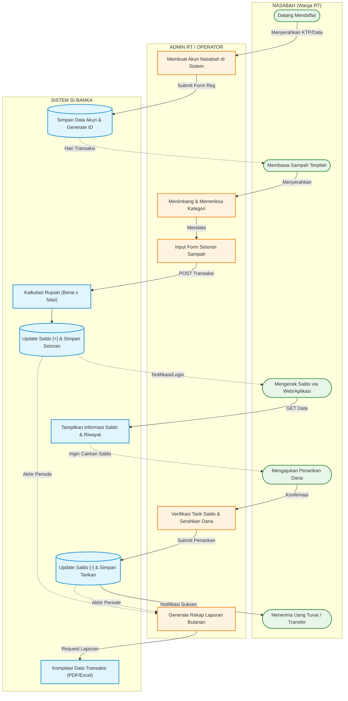

# Diagram Flow Aplikasi Si-Banka (End-to-End Swimlane)

Diagram swimlane ini memvisualisasikan siklus bisnis utama secara keseluruhan di dalam aplikasi **Si-Banka** dari sudut pandang 3 pihak utama: **Nasabah**, **Admin RT (Operator)**, dan **Sistem/Database**.

Mencakup 4 alur utama:
1. Pendaftaran Akun Nasabah.
2. Proses Setoran (Deposit) Sampah.
3. Proses Penarikan (Withdrawal) Saldo.
4. Pengecekan Saldo & Pelaporan.

### Keterangan Alur Siklus:
1. **Fase Pendaftaran**: Nasabah mendaftarkan diri melalui Admin RT, lalu sistem membuatkan `ID Nasabah` dan titik saldo awal (`0`).
2. **Fase Transaksi Rutin**: Nasabah secara berkala membawa sampah terpilah. Admin menimbang dan memilih kategorinya di form, lalu Sistem secara matematis mengkonversi valuasinya ke rupiah dan menambahkan ke saldo Nasabah. 
3. **Fase Kontrol (Nasabah)**: Nasabah bisa kapan saja _login_ untuk mengecek riwayat tabungan dan _dashboard_-nya menggunakan kredensial miliknya.
4. **Fase Penarikan**: Ketika saldo dirasa cukup, nasabah dapat mengajukan pencairan. Admin memberikan uang secara fisik sembari memotong riwayat saldo tersebut di dalam sistem, agar _balance_ tetap tersimpan akurat.
5. **Fase Evaluasi (Admin)**: Saat akhir bulan, Admin melakukan administrasi ekspor (Laporan PDF/Excel) lewat sistem Si-Banka.
