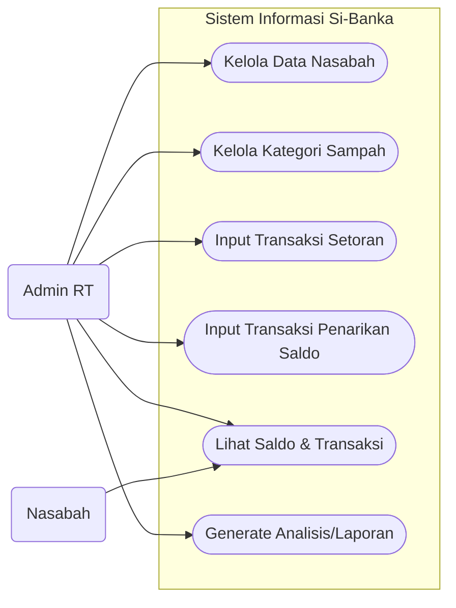
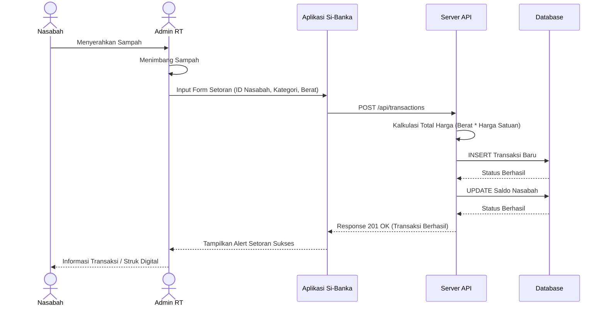
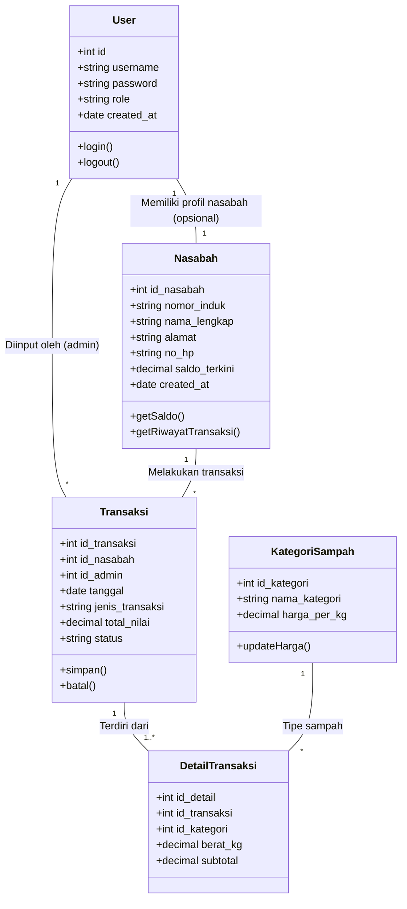

# Dokumentasi Sistem Informasi Bank Sampah (Si-Banka)

Dokumen ini berisi visualisasi alur kerja dan arsitektur sistem Si-Banka menggunakan Swimlane Diagram dan UML (Use Case, Sequence, Class Diagram). Semua diagram di bawah menggunakan standar `mermaid` agar mudah di-render pada platform seperti Markdown preview, GitHub, dll.

## 1. Swimlane Diagram: Alur Setoran Sampah
Diagram ini menggambarkan alur kerja operasional antar peran (Nasabah, Admin RT, dan Sistem Si-Banka) saat proses transaksi setoran sampah berlangsung.

```mermaid
flowchart TD
    subgraph Nasabah
        N1([Membawa Sampah])
        N2([Menerima Bukti Saldo/Setoran])
    end

    subgraph Admin_RT ["Admin RT / Operator"]
        A1[Menerima & Menimbang Sampah]
        A2[Login ke Sistem]
        A3[Input Data Transaksi Setoran]
        A4[Memberikan Informasi Saldo]
    end

    subgraph Sistem_Si_Banka ["Sistem Si-Banka"]
        S1[Validasi Data]
        S2[Kalkulasi Nilai Rupiah\n(Berat x Harga Kategori)]
        S3[(Simpan Data Transaksi &\nUpdate Saldo Nasabah)]
        S4[Tampilkan Notifikasi Berhasil]
    end

    N1 --> A1
    A1 --> A2
    A2 --> A3
    A3 --> S1
    S1 --> S2
    S2 --> S3
    S3 --> S4
    S4 --> A4
    A4 --> N2
```

## 2. Use Case Diagram
Diagram interaksi aktor yang berisi fitur atau tindakan fungsional apa saja yang bisa dilakukan oleh _Admin RT_ (sebagai eksekutor) dan _Nasabah_ di dalam sistem.



## 3. Sequence Diagram: Fitur Setor Sampah
Memvisualisasikan alur atau langkah pertukaran pesan dari User Interface (Frontend) hingga ke API (Backend) dan Database pada satu skenario yaitu **Setoran Sampah**.



## 4. Class Diagram (Model Basis Data)
Merepresentasikan relasi _Entity_ (Tabel data) beserta atribut dan perilakunya yang menjadi fondasi penyimpanan data (Model) pada Si-Banka.


