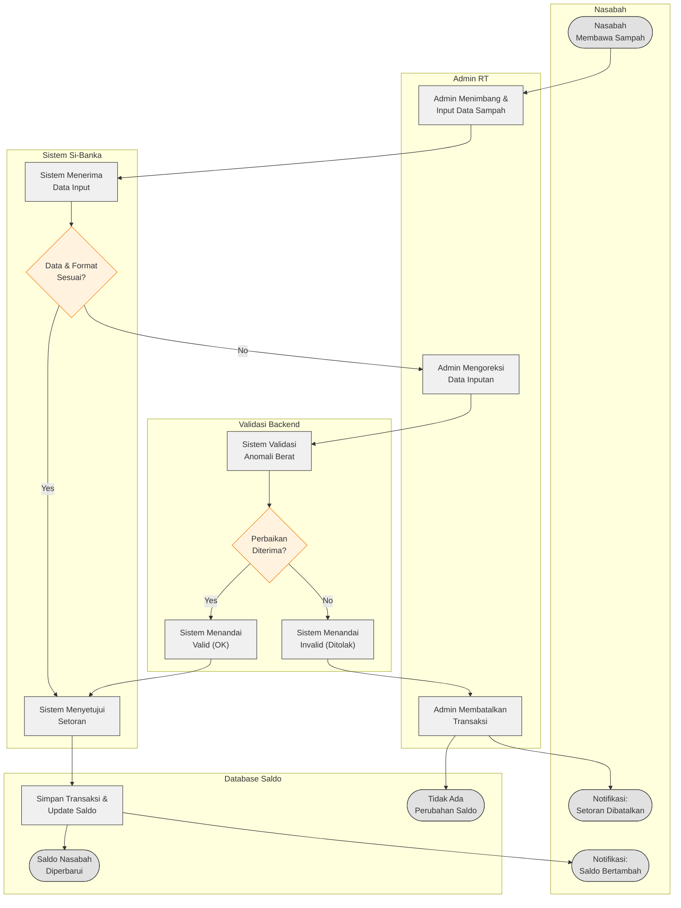

# Diagram Swimlane (Format Persiapan Visio)

Gunakan fitur **Markdown Preview** di VS Code Anda (klik kanan pada *file* ini > pilih **"Open Preview"**) untuk melihat gambarnya secara langsung.

```mermaid
flowchart TD
    %% Konfigurasi style khusus agar mirip standar bentuk Visio
    classDef startend fill:#e1e1e1,stroke:#333,stroke-width:1px,rx:20,ry:20;
    classDef process fill:#f0f0f0,stroke:#333,stroke-width:1px;
    classDef decision fill:#fff3e0,stroke:#f57c00,stroke-width:1px;
    
    subgraph Kolom1 ["Nasabah"]
        N_Start([Nasabah\nMembawa Sampah]):::startend
        N_Fail([Notifikasi:\nSetoran Dibatalkan]):::startend
        N_End([Notifikasi:\nSaldo Bertambah]):::startend
    end

    subgraph Kolom2 ["Admin RT"]
        A_Log["Admin Menimbang &\nInput Data Sampah"]:::process
        A_Req["Admin Mengoreksi\nData Inputan"]:::process
        A_Cancel["Admin Membatalkan\nTransaksi"]:::process
    end

    subgraph Kolom3 ["Sistem Si-Banka"]
        S_Review["Sistem Menerima\nData Input"]:::process
        S_Dec_Valid{"Data & Format\nSesuai?"}:::decision
        S_Approve["Sistem Menyetujui\nSetoran"]:::process
    end

    subgraph Kolom4 ["Validasi Backend"]
        V_Rule["Sistem Validasi\nAnomali Berat"]:::process
        V_Dec_Chg{"Perbaikan\nDiterima?"}:::decision
        V_Ok["Sistem Menandai\nValid (OK)"]:::process
        V_No["Sistem Menandai\nInvalid (Ditolak)"]:::process
    end

    subgraph Kolom5 ["Database Saldo"]
        DB_Save["Simpan Transaksi &\nUpdate Saldo"]:::process
        DB_End([Saldo Nasabah\nDiperbarui]):::startend
        DB_CancelEnd([Tidak Ada\nPerubahan Saldo]):::startend
    end

    %% Routing / Alur Panah
    N_Start --> A_Log
    A_Log --> S_Review
    S_Review --> S_Dec_Valid
    
    %% Jika Standard Terms / Format Sesuai
    S_Dec_Valid -- Yes --> S_Approve
    
    %% Jika Data Ada yang Salah / Tidak Standar
    S_Dec_Valid -- No --> A_Req
    A_Req --> V_Rule
    V_Rule --> V_Dec_Chg
    
    %% Pemeriksaan Koreksi
    V_Dec_Chg -- Yes --> V_Ok
    V_Ok --> S_Approve

    V_Dec_Chg -- No --> V_No
    V_No --> A_Cancel

    %% Alur Batal
    A_Cancel --> N_Fail
    A_Cancel --> DB_CancelEnd

    %% Alur Berhasil / Fulfillment
    S_Approve --> DB_Save
    DB_Save --> DB_End
    DB_Save --> N_End
```
