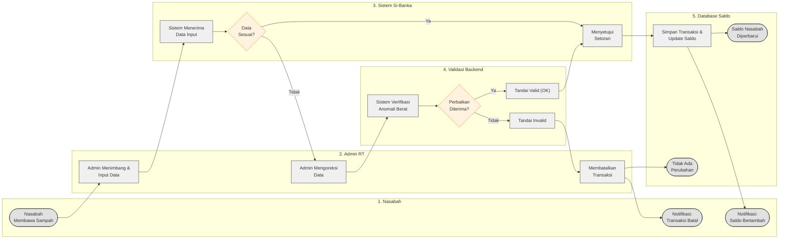

# Diagram Swimlane (Format Horizontal / Visio Rapi)

Gunakan fitur **Markdown Preview** di VS Code. Diagram di bawah telah dikalibrasi ke `flowchart LR` dengan kolom bersisian agar garis-garis alur (_routing_) tidak bertabrakan, sehingga bentuk **Swimlane**-nya jauh lebih rapi dan linier untuk disalin ke Visio.

### 💡 Konversi ke Visio:
Karena di Visio kita bisa menarik garis dengan bebas:
1. Buat **Cross-Functional Flowchart (Vertical)** dengan 5 lanes.
2. Labeli _lanes_ dari kiri ke kanan: **Nasabah**, **Admin RT**, **Sistem**, **Validasi Backend**, dan **Database Saldo**.
3. Taruh setiap blok _shape_ yang ada pada kode ini pada lintasannya masing-masing.
4. Buat garis lurus mengikuti panah. Tidak akan ada garis yang melilit secara tidak beraturan dengan memodelkannya seperti kerangka di atas.
