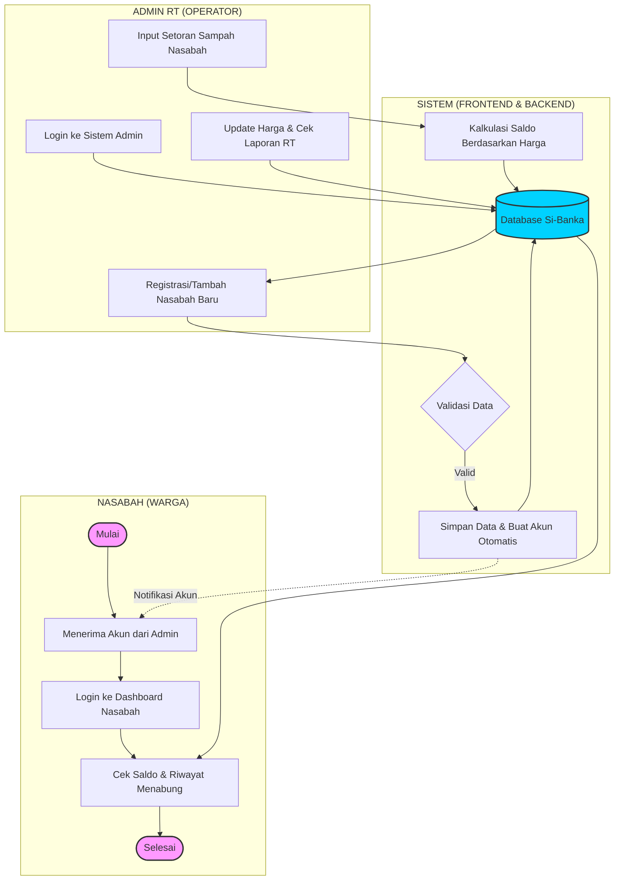

# SWIMLANE FLOWCHART: SI-BANKA
**Alur Kerja Terintegrasi Admin RT & Nasabah**

Berikut adalah diagram flowchart dengan format *swimlane* yang telah diperbarui sesuai dengan logika aplikasi: **Nasabah didaftarkan secara kolektif oleh Admin RT**, bukan mendaftar sendiri, untuk memastikan validitas data warga di lingkungan tersebut.

---

## Penjelasan Jalur (Swimlane) yang Diperbarui

### 1. Jalur Nasabah (Warga)
*   **Penerimaan Akun**: Nasabah tidak mendaftar sendiri. Mereka menerima kredensial (username/password) dari Admin RT setempat.
*   **Monitoring**: Nasabah menggunakan akun tersebut untuk masuk ke dashboard khusus guna memantau jumlah tabungan dan berat sampah yang telah dikontribusikan.

### 2. Jalur Admin RT (Operator)
*   **Registrasi Nasabah**: Admin RT bertanggung jawab melakukan *input* data warga ke dalam sistem. Sistem secara otomatis akan men-generate akun login untuk setiap nasabah yang didaftarkan.
*   **Pencatatan Transaksi**: Admin melakukan input berat sampah setiap kali nasabah datang menyetor.
*   **Penetapan Harga**: Admin mengatur harga beli sampah per item (plastik, kertas, dll) yang menjadi dasar perhitungan saldo nasabah.

### 3. Jalur Sistem (Sistem & Backend)
*   **Automasi Akun**: Saat Admin menambah nasabah, sistem langsung membuatkan record User di database dengan role `nasabah`.
*   **Integrasi Data**: Menjamin saldo nasabah selalu *up-to-date* setiap kali ada transaksi baru yang di-input oleh Admin.
*   **Isolasi Data**: Memastikan data Nasabah RT 01 tidak akan terlihat oleh Admin RT 02 (Sistem Multi-tenant).

---

> [!TIP]
> Perubahan ini memastikan bahwa proses administrasi tetap terpusat di tangan Admin RT, menjaga keamanan data lingkungan, dan memudahkan warga (nasabah) karena mereka tinggal menggunakan akun yang sudah disediakan.
