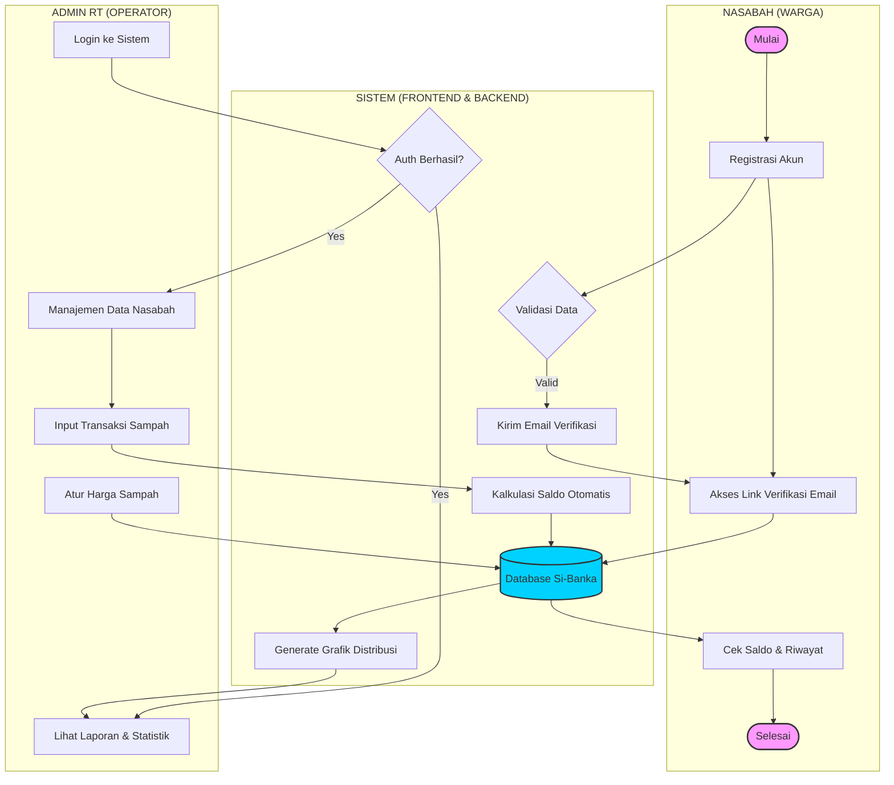

# SWIMLANE FLOWCHART: SI-BANKA

Berikut adalah diagram flowchart dengan format *swimlane* yang menggambarkan alur kerja aplikasi Si-Banka secara menyeluruh. Diagram ini dapat Anda jadikan referensi untuk penyusunan dokumen di Visio atau laporan proyek.

---

## Penjelasan Jalur (Swimlane)

### 1. Jalur Nasabah (Warga)
*   **Registrasi**: User mendaftarkan unit Bank Sampah atau akun nasabah.
*   **Verifikasi**: Melakukan aktivasi melalui email yang dikirimkan sistem.
*   **Monitoring**: Mengakses dashboard pribadi untuk melihat perkembangan tabungan sampah.

### 2. Jalur Admin RT (Operator)
*   **Pengelolaan**: Orang yang memiliki hak akses penuh terhadap unit Bank Sampah RT tertentu.
*   **Operasional**: Melakukan input data sampah (berat, jenis) yang dibawa nasabah.
*   **Manajemen**: Mengatur harga beli sampah per kilogram agar saldo nasabah terhitung otomatis.

### 3. Jalur Sistem (Sistem & Backend)
*   **Validasi**: Memastikan data RT/RW tidak duplikat dan email valid.
*   **Automasi**: Melakukan perhitungan `Berat x Harga = Saldo` tanpa campur tangan manual untuk menghindari kesalahan.
*   **Penyimpanan**: Mengelola database terpusat agar data nasabah aman dan terisolasi per unit RT.
